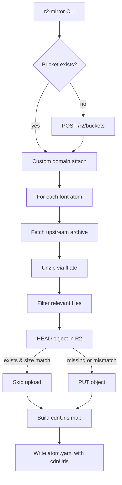

# Plan — Issue #5: R2 mirror script + cdnUrls on font atoms

- **Tech Lead:** tl-cdn
- **Branch:** `feat/cdn-r2-mirror` (from `main` @ d807f32)
- **Scope:** Phase 3.5 — durable CDN mirror of font binaries on Cloudflare R2.

## Outcome

1. `tools/r2-mirror.ts` — Node 22 CLI that:
   - Ensures R2 bucket `brand-atoms-cdn` exists (creates if missing).
   - Attempts to attach `cdn.brand-atoms.com` as a custom domain (graceful degrade if blocked).
   - For each font atom under `fonts/`, downloads the upstream archive specified in `provenance.notes`, extracts the relevant `woff2/ttf` files, and uploads them to `fonts/<slug>/<version>/<filename>` in the bucket.
   - Idempotent: HEAD-then-PUT, skip on size match.
   - `--dry-run` flag prints planned uploads without doing them.
   - After upload, mutates each atom's `cdnUrls` map (additive) and writes the YAML back.
2. `tools/schemas/font.ts` — additive `cdnUrls: z.record(z.string(), z.string().url()).optional()`. Old YAML (no field) must still validate.
3. Five font YAML files populated with `cdnUrls`.

## Mermaid — flow

## Seed commit

**S0 — schema additive.** `tools/schemas/font.ts`: add optional `cdnUrls` map. Lands alone so YAML changes can use it.

## Disjoint sub-tasks (TL-coder hybrid; one author for this scope)

### T1 — Mirror script + tests + deps

- `tools/r2-mirror.ts` (new)
- `tools/__tests__/r2-mirror.test.ts` (new)
- `tools/__tests__/font-schema.test.ts` (new)
- `package.json` (devDep: `fflate`; scripts: `test`, `mirror:r2`)
- `pnpm-lock.yaml`

### T2 — YAML population

- `fonts/inter/1.0.0/atom.yaml`
- `fonts/firacode-nerdfont/1.0.0/atom.yaml`
- `fonts/jetbrainsmono-nerdfont/1.0.0/atom.yaml`
- `fonts/hack-nerdfont/1.0.0/atom.yaml`
- `fonts/cascadiacode-nerdfont/1.0.0/atom.yaml`

Populated by the mirror script's live run.

## Cloudflare access

- Token: `CSO_CF_TOKEN` (sourced via `zsh -ic '...'`).
- Account: `e1fe0f0ce8ff18da4edc118372c30022`.
- Bucket: `brand-atoms-cdn` (confirmed missing pre-run).
- Zone for custom domain: `brand-atoms.com` / `27e45e4614bd806907c5623a590bd675`.
- Custom domain endpoint: `POST /accounts/{id}/r2/buckets/{name}/custom_domains`.

## Upstream sources

| Slug | Archive | Files mirrored |
|------|---------|----------------|
| inter | https://github.com/rsms/inter/releases/download/v4.1/Inter-4.1.zip | `InterVariable.woff2`, `InterVariable-Italic.woff2` |
| firacode-nerdfont | https://github.com/ryanoasis/nerd-fonts/releases/download/v3.4.0/FiraCode.zip | `FiraCodeNerdFontMono-*.ttf` |
| jetbrainsmono-nerdfont | https://github.com/ryanoasis/nerd-fonts/releases/download/v3.4.0/JetBrainsMono.zip | `JetBrainsMonoNerdFontMono-*.ttf` |
| hack-nerdfont | https://github.com/ryanoasis/nerd-fonts/releases/download/v3.4.0/Hack.zip | `HackNerdFontMono-*.ttf` |
| cascadiacode-nerdfont | https://github.com/ryanoasis/nerd-fonts/releases/download/v3.4.0/CascadiaCode.zip | `CaskaydiaCoveNerdFontMono-*.ttf` |

## R2 upload strategy

Use Cloudflare's R2 API v4 (`PUT /accounts/{id}/r2/buckets/{name}/objects/{key}`) — single Bearer-token auth, supports HEAD for idempotency. Avoids the complexity of S3-compat HMAC signing for this one-shot mirror.

## CDN URL shape

- Attached: `https://cdn.brand-atoms.com/fonts/<slug>/<version>/<filename>`.
- Blocked: keep the configured URL shape; documentation notes the blocker.

## Commits

1. `feat(schemas): additive cdnUrls map on Font atom` — seed
2. `feat(cdn): tools/r2-mirror.ts + tests + fflate dep`
3. `feat(fonts): populate cdnUrls for 5 font atoms via R2 mirror`

## Tester checklist

- [ ] HTTP errors propagate (no swallowed catches).
- [ ] HEAD-skip path is actually called.
- [ ] `--dry-run` makes no live PUTs.
- [ ] Schema tests aren't tautological.
- [ ] No hidden TODOs.
- [ ] Custom-domain failure is **reported**, not eaten.

## Acceptance verification

- `pnpm validate` exits 0.
- `pnpm test` exits 0.
- R2 bucket `brand-atoms-cdn` exists; ≥1 object per font slug.
- 5 atom.yaml files contain a `cdnUrls` map.
- PR opened, `Closes #5`.

## Out of scope

- DNS propagation wait loops.
- Cache invalidation.
- Variable-font subsetting.
